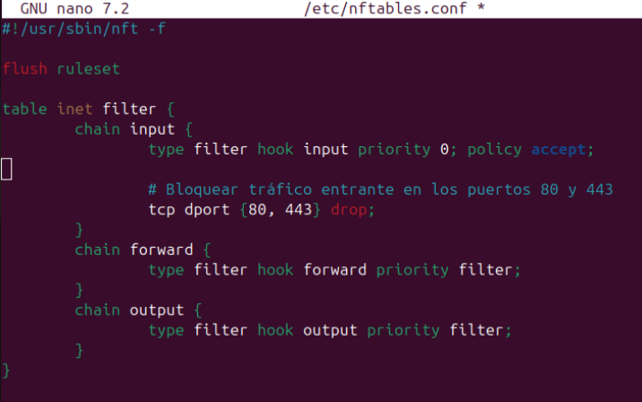
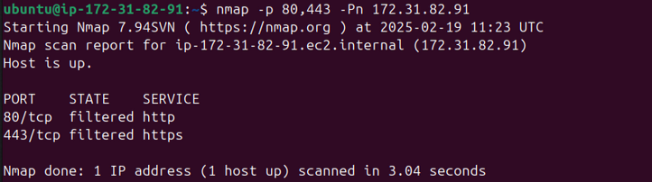

## 1. Configurar NFTables para cerrar los puertos 80 y 443

Editamos la configuración de NFTables:

```
sudo nano /etc/nftables.conf
```

Añade o modifica las siguientes reglas dentro del bloque table *inet filter*:



Guarda el archivo (CTRL + X, Y, Enter) y recarga la configuración:

```
sudo systemctl restart nftables
```
Verifica que las reglas se han aplicado:

```
sudo nft list ruleset
```

## 2. Prueba de Bloqueo de Puertos

Para asegurarte de que los puertos 80 y 443 están bloqueados, usa nmap (si no lo tienes, instálalo con sudo apt install nmap -y):

```
nmap -p 80,443 -Pn <TU_IP>
```



Si quieres dejar desactivado NFTables podremos hacer el siguiente comando:

```
sudo systemctl disable --now nftables
```

Si quieres dejar activar NFTables podremos hacer el siguiente comando:

```
sudo systemctl enable --now nftables
``
