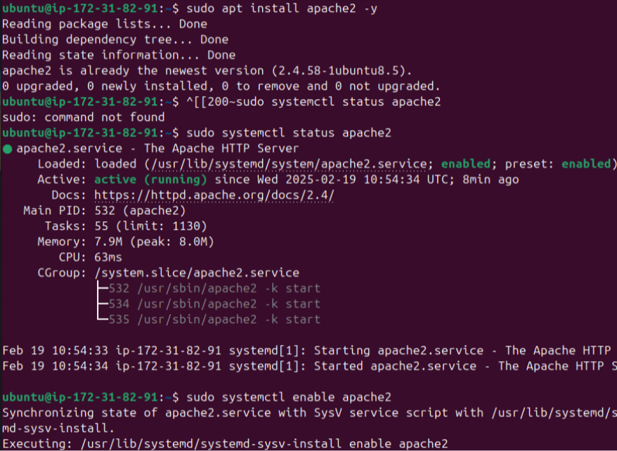
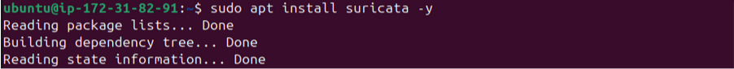

## 1. Instalar Apache2
```
sudo apt install apache2 -y
```

Verifica que Apache esté corriendo:

```
sudo systemctl status apache2
```

Si quieres que Apache se inicie automáticamente en cada reinicio:

```
sudo systemctl enable apache2
```
 

## 2. Instalar Suricata

Suricata es un sistema de detección de intrusos (IDS/IPS). Instalémoslo con:

```
sudo apt install suricata -y
```

 

Verifica la versión instalada:

```
suricata --version
```
Si deseas iniciar Suricata manualmente:

```
sudo systemctl start suricata
```

Para que se ejecute en cada reinicio:

```
sudo systemctl enable suricata
```

## 3. Instalar NFTables

NFTables reemplaza a iptables en sistemas modernos y nos permitirá bloquear los puertos 80 y 443.

```
sudo apt install nftables -y
```

Habilita el servicio para que se inicie automáticamente:

```
sudo systemctl enable nftables
```

Inicia el servicio:

```
sudo systemctl start nftables
```

